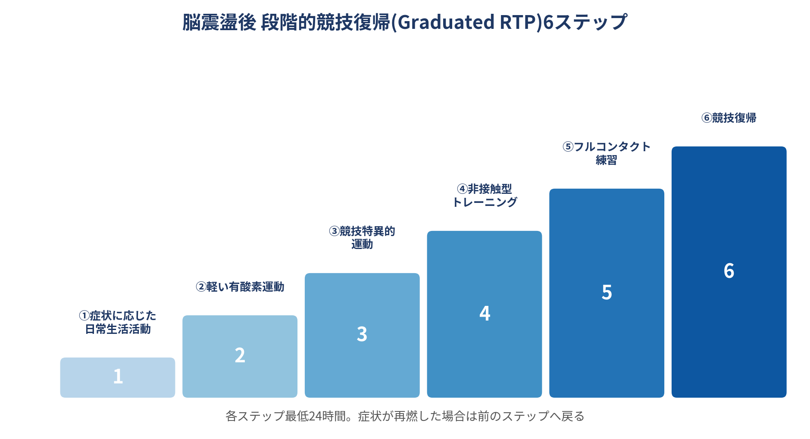

## Issue #4:脳震盪後の段階的競技復帰 — 「症状ゼロ」から「元の負荷」への道筋

### 1. なぜ画一的な安静期間ではダメなのか

脳震盪は、頭部・頸部・身体への衝撃が脳に伝わることで生じる外傷性脳損傷であり、神経伝達物質やエネルギー代謝の連鎖的変化を引き起こす。国際スポーツ脳震盪会議(2022年アムステルダム声明)は、受傷後24〜48時間の安静には一定の効果を示すエビデンスがある一方、それ以降も安静を継続することへの明確な根拠は乏しいと指摘している。現在の国際コンセンサスは、症状の悪化を招かない範囲で段階的に負荷を上げていく「Graduated RTP(段階的競技復帰)」を推奨している。

### 2. 6段階のプロトコル

- **①症状に応じた日常生活活動**:認知的・身体的負荷を最小限に抑えた生活
- **②軽い有酸素運動**:ウォーキングや軽いエアロバイクなど
- **③競技特異的運動**:ランニングドリルなど、頭部への衝撃を伴わない運動
- **④非接触型トレーニング**:より複雑な運動・非接触型の練習ドリル
- **⑤フルコンタクト練習**:医学的クリアランス後の通常練習参加
- **⑥競技復帰**:制限なしの試合復帰

各ステップは最低24時間かけて進み、症状の悪化がなければ翌日に次のステップへ進む。症状が再燃した場合は、症状が消えたステップまで戻ることが基本原則とされる。

### 3. 「症状がないこと」だけでは不十分

興味深い点として、SCAT6(Sport Concussion Assessment Tool第6版)などの評価ツールが標準化されている一方で、実際のプロトコル運用は施設によってばらつきが大きいとの報告がある。特に復帰基準・タイムライン・医療スタッフの配置状況は、施設間で一貫性を欠くとの指摘があり、標準化されたケアの必要性が繰り返し強調されている。

つまり、「本人が症状を訴えない」ことだけを復帰基準にするのはリスクがあり、SCAT6のような客観的評価ツールと組み合わせた総合判断が望ましい。

### 4. 臨床への応用ポイント

- 受傷後24〜48時間は認知的・身体的負荷を抑えた安静を勧めるが、それ以降は漫然と安静を継続しない
- 6段階のプロトコルに沿って、症状の悪化がない範囲で段階的に負荷を上げる
- 各ステップは最低24時間。症状が出た場合は前のステップへ戻る
- 「本人の自己申告で症状がない」ことのみに依存せず、SCAT6等の客観的評価を併用する
- 最終的な競技復帰の可否判断は医療者の管理下で行う

### 参考文献

Patricios JS, Schneider KJ, Dvorak J, et al. Consensus statement on concussion in sport: the 6th International Conference on Concussion in Sport–Amsterdam, October 2022. Br J Sports Med. 2023;57:695-711.

"Put Me Back In, Coach!" Concussion and Return to Play. PMC収載レビュー(Zurich 2012コンセンサスに基づく段階的RTPの解説).

Understanding the NCAA Concussion Protocol: What Athletes and Coaches Need to Know. 2025年のNCAA施設間比較調査の紹介記事.

CDC HEADS UP. Returning to Sports(6-Step Return to Play Progressionの解説ページ).
