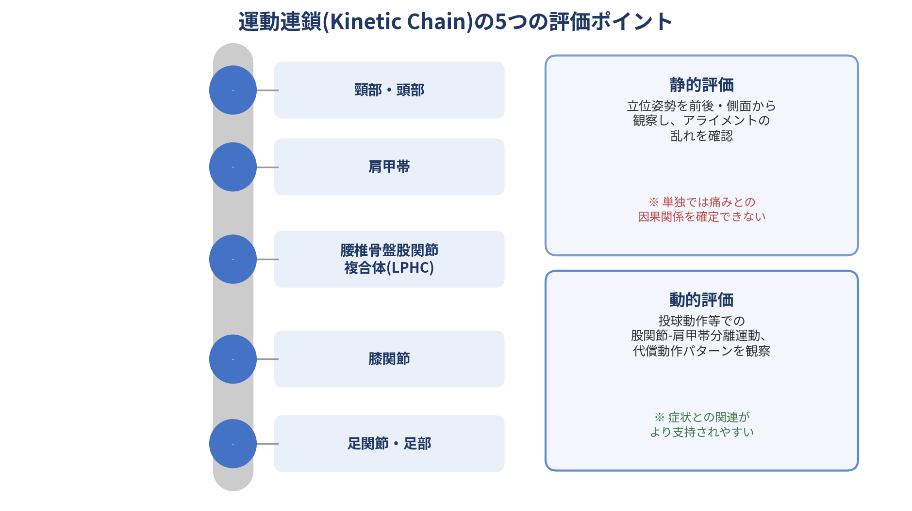

## Issue #5:運動連鎖(Kinetic Chain)に基づく姿勢・動作評価の臨床応用

### 1. なぜ「痛いところだけ」を診るのでは不十分なのか

肩の痛みを訴える患者に対して、肩関節そのものだけを評価・治療するのは、臨床現場で根強く残る習慣である。しかし近年の研究は、症状のある部位から離れた場所の機能不全が、痛みの一因になっているケースを繰り返し報告している。例えば投球障害肩の分析では、股関節・胸郭・肩甲帯が連動する「運動連鎖」の中で、どこか一箇所に機能不全があると、その代償として肩関節への負荷が増大することが示されている。バレーボールやハンドボール選手を対象にした研究でも、肩の痛みを持つ選手は運動連鎖上の複数箇所に運動学的な変化を示すことが報告されており、これはアスリートに限らず一般の肩痛患者でも同様の傾向が示唆されている。

### 2. 評価の実際:静的評価と動的評価

- **静的姿勢評価**:立位姿勢を前方・側方・後方から観察し、5つのチェックポイント(足関節・膝関節・腰椎骨盤股関節複合体・肩甲帯・頸部)でのアライメントの乱れを確認する。円背・巻き肩・骨盤の前後傾など、いわゆる「上位交差性症候群」「下位交差性症候群」と呼ばれる特定の筋の短縮・過活動パターンを見つける手がかりになる。
- **動的動作評価**:投球動作を例にとると、骨盤が先に回旋し、肩がやや遅れて回旋することで体幹に捻れのエネルギーが生まれ、それが運動連鎖を通じて末端(腕)のスピードに変換される。胸郭の回旋可動域が制限されていると、この「股関節と肩の分離」が不十分になり、腕への負荷が増大する。

### 3. 「姿勢の乱れ=痛みの原因」とは限らない

ここで注意すべき重要な点がある。肩の痛みを持つ一般人(非アスリート)を対象にした系統的レビューでは、運動連鎖上のさまざまな特徴が痛みのある群とない群で異なることが報告されている一方、それが「原因」なのか「結果」なのかを明確に区別できるほどの質の高いエビデンスは、現時点では十分にそろっていないと指摘されている。

つまり、静的な姿勢の乱れを見つけたとしても、それが本当にその患者の痛みの原因かどうかは、それだけでは判断できない。動的な動作評価(実際の動きの中での代償パターン)の方が、症状との関連性がより支持されやすい傾向にあり、静的評価はあくまで「仮説を立てるための手がかり」として位置づけるのが妥当である。

### 4. 臨床への応用ポイント

- 症状のある部位だけでなく、運動連鎖全体(足関節・膝・LPHC・肩甲帯・頸部)を評価対象に含める
- 静的姿勢評価で見つかった「乱れ」を、そのまま痛みの原因と決めつけない。動的な動作評価と組み合わせて仮説を検証する
- スポーツ動作(投球・打撃・ジャンプ等)を伴う患者では、股関節と肩甲帯の分離運動、胸郭回旋可動域を重点的に確認する
- 治療は痛みのある関節だけでなく、代償の起点となっている箇所(足関節・股関節・胸郭など)にも介入する

### 参考文献

da Silva Barros BR, de Barros AC, da Silva Júnior N, Cavalcanti IB, de Oliveira Sousa C. Motor alterations along the kinetic chain in amateur volleyball and handball athletes with shoulder pain: An observational comparative study. J Bodyw Mov Ther. 2024;39:364-72.

Thinking outside the shoulder: A systematic review and metanalysis of kinetic chain characteristics in non-athletes with shoulder pain. 2024年系統的レビュー(MEDLINE/CINAHL/Web of Science等5データベース対象).

Kaplan A. Overhead Athlete Kinetic Chain Assessment and Treatment Course. Physiopedia Plus, 2025(股関節-肩甲帯分離運動・胸郭回旋評価の解説).

Kinetic Chain Assessments Streamlined. NASM blog(Jandaの筋バランス異常パターン・5つのチェックポイントの解説).
