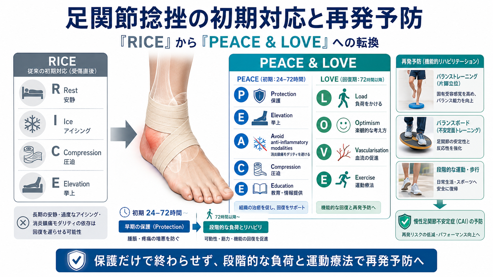

## Issue #6:足関節捻挫の初期対応と再発予防 — 「RICE」から「PEACE & LOVE」への転換

### 1. なぜ「冷やして安静」だけでは不十分なのか

足関節捻挫は臨床現場で最も遭遇頻度の高い外傷の一つだが、長年標準とされてきた「RICE(Rest・Ice・Compression・Elevation)」は、近年その根拠が見直されている。2020年に提唱された「PEACE & LOVE」というフレームワークは、受傷直後の保護・抗炎症薬への過度な依存の回避・教育を経て、早期から適切な負荷をかけていくことの重要性を強調する。単純な安静・冷却の継続指導だけでは、組織の治癒に必要な負荷刺激が不足し、慢性的な足関節不安定性(CAI:Chronic Ankle Instability)につながるリスクがある。

### 2. PEACE & LOVEの中身

- **P(Protection)**:受傷後1〜3日は患部を保護し、痛みを誘発する動作を避ける。ただし完全な安静・固定を漫然と継続しない
- **E(Elevation)**:患部を心臓より高く挙上し、腫脹を管理する
- **A(Avoid anti-inflammatory modalities)**:NSAIDsやアイシングの多用は組織治癒を遅らせる可能性が指摘されており、必要最小限にとどめる
- **C(Compression)**:テーピングや弾性包帯で腫脹をコントロールする
- **E(Education)**:安静を長引かせすぎず、予後は概ね良好であることを患者に伝え、積極的な受容を促す
- **L(Load)**:痛みの範囲内で早期から荷重・可動域訓練を再開する
- **O(Optimism)**:回復への前向きな心理状態が転帰に影響することを踏まえた声かけをおこなう
- **V(Vascularisation)**:痛みのない範囲での有酸素運動により血流を促進する
- **E(Exercise)**:バランス・固有受容感覚トレーニングを含む運動療法で可動性・筋力・安定性を回復させる

### 3. 「早期に動かせば良い」わけでもない現実

興味深いのは、急性期のごく初期(受傷後24〜72時間程度)については保護的な対応に一定の合理性が認められる一方、その後も画一的に安静を継続する明確な根拠は乏しいという点である。つまり、「早期から動かす」という原則は、「受傷直後から強い負荷をかけてよい」という意味ではなく、痛みや腫脹の経過を見ながら保護と負荷のバランスを段階的に移行させることが求められる。

### 4. 再発予防に不可欠なバランス・固有受容感覚トレーニング

足関節捻挫は再受傷率が高く、初回受傷後に十分なリハビリテーションを経ないまま復帰すると、CAIに移行しやすいことが報告されている。急性期の炎症管理だけで終わらせず、片脚立位・不安定面でのバランス訓練など、運動連鎖全体を意識した固有受容感覚トレーニングを回復期に組み込むことが、再発予防の観点から重要である。

### 5. 臨床への応用ポイント

- 受傷後24〜72時間はPEACE(保護・挙上・抗炎症モダリティの節度ある使用・圧迫・教育)を基本とする
- その後はLOVE(早期荷重・前向きな声かけ・有酸素運動・運動療法)へ段階的に移行し、漫然とした安静継続を避ける
- アイシング・NSAIDsは症状緩和目的で短期的に用いる場合も、多用による治癒遅延のリスクを念頭に置く
- 急性期の炎症管理が落ち着いた段階で、片脚立位やバランスボード等を用いた固有受容感覚トレーニングを導入し、再受傷・CAI移行を防ぐ
- 復帰基準は「腫れや痛みがないこと」だけでなく、患側・健側のバランス能力・筋力の対称性も評価に含める

### 参考文献

Dubois B, Esculier JF. Soft-tissue injuries simply need PEACE and LOVE. Br J Sports Med. 2020;54(2):72-73.

Vuurberg G, et al. Diagnosis, treatment and prevention of ankle sprains: update of an evidence-based clinical guideline. Br J Sports Med. 2018;52(15):956.

Hertel J, Corbett RO. An Updated Model of Chronic Ankle Instability. J Athl Train. 2019;54(6):572-588.

Gribble PA, et al. Selection Criteria for Patients With Chronic Ankle Instability in Controlled Research: A Position Statement of the International Ankle Consortium. J Athl Train. 2014;49(1):121-127.
